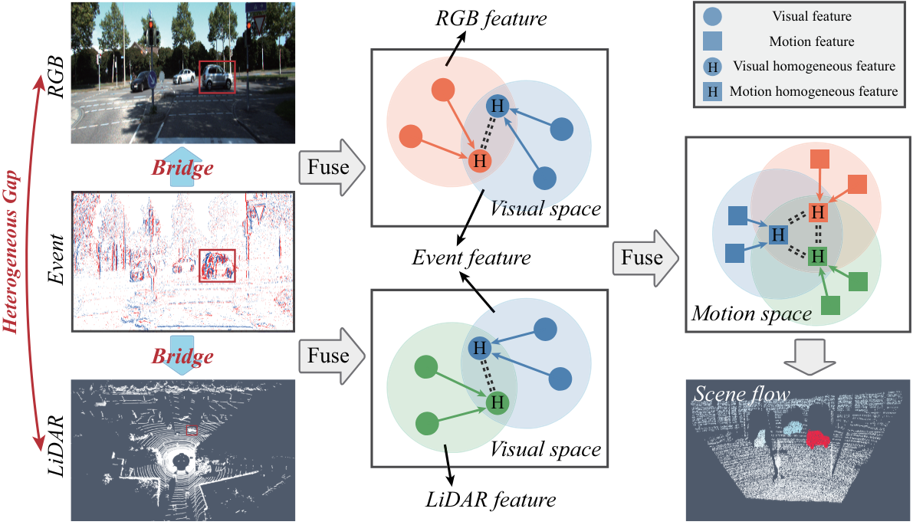
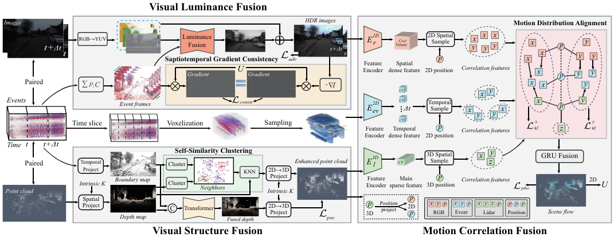

# Bring Event into RGB and LiDAR: Hierarchical Visual-Motion Fusion for Scene Flow

## CVPR 2024

### [Paper](https://openaccess.thecvf.com/content/CVPR2024/papers/Zhou_Bring_Event_into_RGB_and_LiDAR_Hierarchical_Visual-Motion_Fusion_for_CVPR_2024_paper.pdf) | [arXiv](https://arxiv.org/pdf/2403.07432)

[Hanyu Zhou](https://hyzhouboy.github.io/) $^{1}$, [Yi Chang](https://owuchangyuo.github.io/) $^{1✉}$, [Zhiwei Shi](https://scholar.google.com/citations?user=lgiDifUAAAAJ&hl=zh-CN) $^{1}$, [Luxin Yan](https://scholar.google.com/citations?user=5CS6T8AAAAAJ&hl=en) $^{1}$

$^1$ Huazhong University of Science and Technology

$^✉$ Corresponding Author.



⭐**Our VisMoFlow makes success in 3D scene flow estimation via multi-sensor fusion.**

## Framework



Our VisMoFlow framework consists of three components: visual fusion and motion fusion. The former builds the luminance fusion between frame and event modalities to enhance high dynamic range, and the structure fusion between LiDAR and event modalities to improve contour integrity, while the latter builds the correlation fusion between frame, event and LiDAR modalities to promote the spatiotemporal density of 3D motion fields.

## News

2026.1.5: Training, testing codes and pre-trained weights are released.

2024.2.28: Our paper is accepted by CVPR 2024.

## Environmental Setups

```
git clone https://github.com/hyzhouboy/VisMoFlow.git
cd VisMoFlow
conda create -n VisMoFlow python=3.7
conda activate VisMoFlow

conda install pytorch==1.10.2 torchvision==0.11.3 cudatoolkit=11.3 -c pytorch
pip install openmim
mim install mmcv-full==1.4.0
mim install mmdet==2.14.0
pip install opencv-python open3d tensorboard hydra-core==1.1.0

cd models/csrc
python setup.py build_ext --inplace
```

Download the ResNet-50 pretrained on ImageNet-1k:

```
wget https://download.pytorch.org/models/resnet50-11ad3fa6.pth
mkdir pretrain
mv resnet50-11ad3fa6.pth pretrain/
```

## Preparing Dataset

In this work, the main training datasets include Event-KITTI and DSEC, where the Event-KITTI is a synthetic dataset. As for Event-KITTI, you can introduce [v2e](https://github.com/SensorsINI/v2e) to generate event data from videos/images of KITTI, and then produce the corresponding data and labels required by scene flow estimation via running *generate_kitti_labels.py*. As for DSEC, you can download [DSEC](https://github.com/SensorsINI/v2e) and then process it into the corresponding labels via running *generate_dsec_labels.py*. Here the processed DSEC dataset can be downloaded at [Link](https://drive.google.com/drive/folders/1p-gz3HcR6bp65Ms6IGaHCIhAPwOXQ_LE).

## Training

We divide the whole training into several stages (please refer to train.sh).

Stage 1: Initialize our model for frame-based scene flow using KITTI dataset.

```
python train.py trainset=kitti valset=kitti model=camliraft ckpt.path=checkpoint/vismoflow_initial.pt
```

And set the training parameters in `kitti.yaml`:

```
# @package _global_
trainset:
  name: kitti
  root_dir: /Your_KITTI_Path/data_scene_flow
  split: training160
  n_workers: 8
  drop_last: false

  max_depth: 90
  n_points: 8192

  augmentation:
    enabled: true
    color_jitter:
      enabled: true
      brightness: 0.4
      contrast: 0.4
      saturation: 0.2
      hue: 0.127  # 0.4/3.14
    random_horizontal_flip:
      enabled: true
    random_vertical_flip:
      enabled: false
    random_crop:
      enabled: false
    random_scale:
      enabled: true
      scale_range: [1.0, 1.5]
```

Stage 2: Training our model for multimodal-based scene flow using Event-KITTI dataset.

```
python train.py trainset=kitti_event valset=kitti_event model=vismoflow ckpt.path=checkpoint/vismoflow_evkitti.pt
```

And set the training parameters in `kitti_event.yaml`:

```
# @package _global_
trainset:
  name: kitti_event
  root_dir: /Your_Event_KITTI_Path/data_scene_flow
  split: training160
  n_workers: 8
  drop_last: false

  max_depth: 90
  n_points: 8192

  augmentation:
    enabled: true
    color_jitter:
      enabled: true
      brightness: 0.4
      contrast: 0.4
      saturation: 0.2
      hue: 0.127  # 0.4/3.14
    random_horizontal_flip:
      enabled: true
    random_vertical_flip:
      enabled: false
    random_crop:
      enabled: false
      crop_size: [720, 256]
      drop_pc: false
    random_scale:
      enabled: true
      scale_range: [1.0, 1.5]

  events:
    num_bins: 3
    time_slice: 3
    time_delta: 15000

  stage: 1
```

Note that this `stage` parameter is set from 1 to 4 to run the model training code four times. "`stage: 1`" denotes trainer optimization for reconstruction, "`stage: 2`" denotes trainer optimization for HDR, "`stage: 3`" denotes trainer optimization for cloud in-painting, and "`stage: 4`" denotes trainer optimization for motion fusion.

Stage 3: Training our model for multimodal-based scene flow using the processed DSEC dataset.

```
python train.py trainset=dsec valset=dsec model=vismoflow ckpt.path=checkpoint/vismoflow_dsec.pt
```

And set the training parameters in `dsec.yaml`:

```
# @package _global_
trainset:
  name: dsec
  root_dir: /Your_DSEC_Path
  split: training
  n_workers: 8
  drop_last: false

  max_depth: 90
  n_points: 8192

  augmentation:
    enabled: true
    color_jitter:
      enabled: true
      brightness: 0.4
      contrast: 0.4
      saturation: 0.2
      hue: 0.127  # 0.4/3.14
    random_horizontal_flip:
      enabled: true
    random_vertical_flip:
      enabled: false
    random_crop:
      enabled: true
      crop_size: [520, 380]
      drop_pc: true
    random_scale:
      enabled: true
      scale_range: [1.0, 1.5]

  events:
    num_bins: 3
    time_slice: 3
    time_delta: 15000

  stage: 1
```

Note that this `stage` parameter is set from 1 to 4 to run the model training code four times. "`stage: 1`" denotes trainer optimization for reconstruction, "`stage: 2`" denotes trainer optimization for HDR, "`stage: 3`" denotes trainer optimization for cloud in-painting, and "`stage: 4`" denotes trainer optimization for motion fusion.

Finally, we also provide the trained model files [VisMoFlow model](https://drive.google.com/file/d/1oXlrfNFbpyILdn4QoqyljZFJWAHecvqv/view?usp=sharing) for inference.

## Testing

After training or obtaing the trained VisMoFlow model, we can perform the inference code (please refer to *demo.py*):

```
# run demo 1: scene flow
python demo.py --model vismoflow --weights model/vismoflow_dsec.pt
```

Your also can run other demos, please refer to *demo.py* for details.

## Citation

If you find this repository/work helpful in your research, welcome to cite the two papers and give a ⭐.

```
@inproceedings{zhou2024bring,
  title={Bring event into rgb and lidar: Hierarchical visual-motion fusion for scene flow},
  author={Zhou, Hanyu and Chang, Yi and Shi, Zhiwei},
  booktitle={Proceedings of the IEEE/CVF Conference on Computer Vision and Pattern Recognition},
  pages={26477--26486},
  year={2024}
}
```

## Acknowledge

We thank [CamLiFlow](https://github.com/MCG-NJU/CamLiFlow), [RPEFlow](https://github.com/danqu130/RPEFlow) and [v2e](https://github.com/SensorsINI/v2e) for their open-source code and data contributions.
